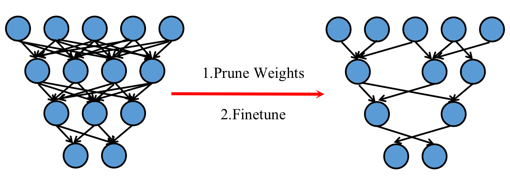
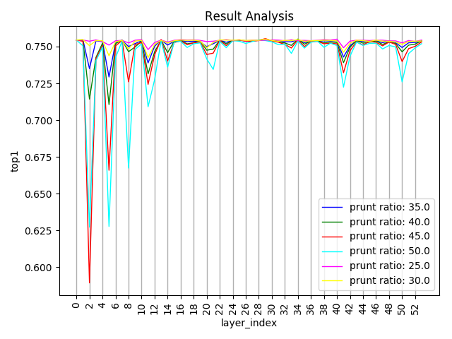

# MicroNet Challenge

by Mengze Zeng(曾梦泽), Jie Hu(胡杰),  Ziheng Wu(吴梓恒) from [Momenta](https://www.momenta.ai/)

[TOC]

## Methodology

### BaseModel

### Sparsity

Non-structured pruning is an efficient way to reduce the computing and storage requirements of convolutional neural network in the future。

#### Han's Strategy(DSD)

Acorrding to Han's proposal, dense-sparse-dense training flow is a  novel training strategy which will keep maintain or even improve the neural network classification accuracy after iteratively sparse pruning and retraining process.(as figure.1)

#### Implementation

Implementation of DSD(dense-sparse-dense) strategy with caffe is used to pruning our proposal network.  DSD pipeline includes:

- Sensitivity Analysis:  [commit](https://github.com/Zeitzmz/micronet-caffe/commit/d42e729e2232777b28eeb6446d7f7d2e58ea1d79)
- GenerateMask :        [commit](https://github.com/Zeitzmz/micronet-caffe/commit/f8303ac4b56bc74a832d35d8f69742345eb54c9e)
- Pruning & Retrain:    [commit](https://github.com/Zeitzmz/micronet-caffe/commit/f8303ac4b56bc74a832d35d8f69742345eb54c9e)

##### Sensitivity Analysis 

commit info: [commit](https://github.com/Zeitzmz/micronet-caffe/commit/d42e729e2232777b28eeb6446d7f7d2e58ea1d79)

According to Han's proposal, pruning procedure is to replace the weights which has smaller absolute value than others in the same layer with zero. This proposal is kind of heuristic but effective.   Sensitivity Analysis is a method to decide which layers needed to be pruned and the sparsity of these layers after pruning.  Our implemented tool allows us to:

- Assign the layer to be pruned and percentage of sparsity for a trained model, and test the accuray of the pruned model.

With traversing the accuracy of different sparsity and layer combination with in our target layer with python or shell scripts, we will get a sensitivity map as bellow:

With this map, we will find which layers are important and can't be  over pruned。Heuristiclly, we choose some 'unimportant' layers with their proposal prune ratio  and generate a config file.

##### GenerateMask

commit info:  [commit](https://github.com/Zeitzmz/micronet-caffe/commit/f8303ac4b56bc74a832d35d8f69742345eb54c9e)

Sensitivity analysis generates a config file which records the layers name and sparsity. This tool is to provide the zero mask which will be needed during caffe infer (after final prune) and DSD retrain.

- Assign the model file and config file , generate the zero-one maskfile.

##### Pruning & Retrain

Commit info:  [commit](https://github.com/Zeitzmz/micronet-caffe/commit/f8303ac4b56bc74a832d35d8f69742345eb54c9e)

Our modified caffe support to finetune the sparse layer which will keep the sparsity during finetune.

- Forward: mask the sparse part with input mask, and forward.
- Backword:  backword normally, and mask the diff , then update weights. zero part will keep zero during the finetune. 

During  our experiments we noticed that iteratively DSD and Re-Dense Part is hardly to improve the sparsity of our final model with target accuracy limitation, so we just stop at the retrain part with mask which not more future re-densing and pruning.

**With this incomplete dsd approach(sensitivity_analysis - prune - retain_with_mask), we're able to prune our trained model at 30~50% sparsity with slightly loss in accuracy.** 

### Quantization

## Training & Testing

## Scoring

